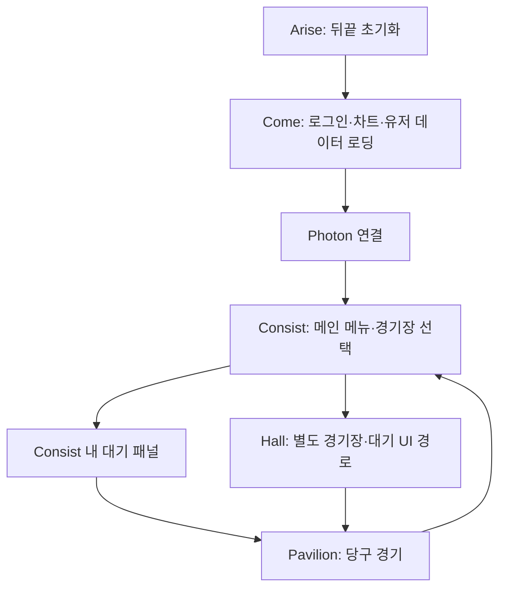
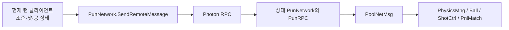

# MagicOnline2 프로젝트 구조 및 재연결 안내

작성일: 2026-09-17  
분석 대상: 현재 MagicOnline2의 Assets/Scripts, 씬, 프로젝트 설정, 포함된 SDK.

이 문서는 소스와 로컬 설정을 분석한 결과다. Photon/뒤끝 콘솔에 로그인하거나 원격 데이터를 조회·수정하지 않았다. 설정값이 존재한다는 사실과 실제 서버 연결 성공은 구분해야 한다. App ID·Signature Key·테스트 계정 비밀번호 원문은 기록하지 않았다.

## 1. 어떤 게임인가

Unity 기반 2인 온라인 당구 게임이다. 코드에는 3구/4구, 쿠션 조건, 목표 득점, 경기 제한 시간, 턴 제한 시간, 마무리 미션과 재경기 흐름이 있다. 공 이동에 따른 코인·아이템·감정 표현 등 연출도 포함한다.

역할은 크게 다음과 같다.

| 구성 | 담당 |
|---|---|
| Unity 클라이언트 | UI, 당구 물리, 조준·타격, 득점·턴·경기 종료 판단 |
| Photon PUN 2 | 접속, 로비·2인 방, 상대 정보, 경기 중 RPC 전달 |
| 뒤끝 | 회원 로그인, 유저 정보·재화·전적 데이터, 경기장 설정 차트, 출석 데이터 |
| UniTask | 지연 실행, 프레임 대기, 네트워크 수신 시간에 맞춘 처리, UI 애니메이션 |

Photon과 뒤끝을 연결해 주는 별도 서버가 소스에 있는 구조는 아니다. 클라이언트가 두 서비스에 각각 연결하며, 뒤끝 유저 식별값을 Photon에서도 사용한다.

## 2. 현재 개발 환경

| 항목 | 로컬에서 확인한 상태 |
|---|---|
| Unity | 6000.5.7f1 |
| 렌더 파이프라인 | URP 17.5.0 |
| Photon | Assets/Photon에 포함된 PUN 2.42 |
| 뒤끝 | Assets/TheBackend에 포함된 SDK 5.11.1 / Backend.dll 5.11.1.0 |
| UniTask | Packages/manifest.json에 Git 패키지 2.5.11 등록 |
| Input System | 1.20.0 설치, Active Input Handling은 Both |
| 빌드 씬 목록 | EditorBuildSettings에는 SampleScene만 등록됨 |

Photon과 뒤끝은 Assets 폴더에 SDK가 직접 들어 있으므로 Package Manager 목록만 보면 설치 여부를 놓칠 수 있다. 현재 코드가 기존 UnityEngine.Input과 StandaloneInputModule을 사용하므로 Both 설정을 유지하고, 변경 후 에디터를 재시작해야 한다.

PUN 2는 공식적으로 유지보수/LTS 단계다. 기존 프로젝트 복구 단계에서는 현재 PUN 흐름부터 확인하고, Fusion 등으로의 교체는 별도 작업으로 판단하는 편이 좋다. [Photon 공식 설정 문서](https://doc.photonengine.com/pun/current/getting-started/initial-setup)

## 3. 씬과 실행 순서

| 씬 | 주요 코드 | 기능 |
|---|---|---|
| Arise | BackendDuty, AriseMng | Backend.Initialize(true), AsyncPoll, 시작 로딩 후 Come 이동 |
| Come | PnlLogin, NetworkDuty | 로그인 → 데이터 로딩 → Photon 접속 → Consist 진입 |
| Consist | MainSwipe, MainComp, RoomSwipe, PnlLobby, PnlPrime | 세로 메뉴 전환, 경기장 카드, 방 참여 및 대기 |
| Hall | Hall/PnlLobby, PnlWaitRoom | 별도 로비·대기 흐름. PnlPrime.MatchEnter_Click에서 진입하는 코드가 남아 있음 |
| Pavilion | PnlMatch, PoolCoach, PoolLogic, PhysicsMng | 경기 초기화, 샷·물리·턴·점수·종료 처리 |
| SampleScene | 새 프로젝트 기본 씬 | 현재 빌드 설정에는 이 씬만 등록됨 |

**온라인 기능의 기본 시작점은 Arise다.** Consist만 실행하는 것은 UI 확인용에 가깝다. BackendDuty, 로그인된 유저, 로딩된 차트, Photon 연결이 준비됐다는 보장이 없다.

BackendDuty, NetworkDuty, NetworkEngine은 DontDestroyOnLoad를 사용해 씬 전환 뒤에도 유지되는 구조다. MainSwipe의 null 대응은 직접 실행 시 오류를 줄인 조치이며, 로그인·서버 초기화를 대신하지 않는다.

복구할 때 빌드 씬 목록에 Arise, Come, Consist, Hall, Pavilion을 등록하고 Arise를 첫 씬으로 두어야 한다. 실제 사용하는 Build Profile에 별도 씬 목록이 있다면 그것도 확인한다. 이번 정리 작업에서는 씬 목록을 변경하지 않았다.

## 4. 로그인부터 Photon까지

1. Arise의 BackendDuty.Awake에서 Backend.Initialize(true)를 호출한다.
2. BackendDuty.Update에서 Backend.AsyncPoll()을 호출해 뒤끝 비동기 응답을 처리한다.
3. AriseMng의 로딩 완료 콜백이 Come을 연다.
4. PnlLogin은 CustomLogin 또는 GuestLogin을 호출한다.
5. 로그인 성공 후 UserMain 존재 확인, 전체 차트 로딩, 출석 데이터 조회를 수행한다.
6. LoginAfter → NetworkDuty.NetworkSetup에서 계정 정보와 UserMain을 읽는다.
7. NetworkManager.uuid에 Backend.UserInDate를 넣고 닉네임·보유 코인을 설정한다.
8. NetworkManager.network 접근 시 Network 오브젝트와 PunNetwork를 생성한다.
9. PunNetwork.Connect는 AuthenticationValues(uuid)를 지정하고 ConnectUsingSettings()를 호출한다.
10. OnConnected → NetworkDuty → LoadMainPlayer → PoolPlayer 설정 후 Consist로 이동한다.
11. OnConnectedToMaster에서는 PhotonNetwork.JoinLobby()를 호출한다.

주의: 현재 Consist 이동 신호는 OnConnected에 걸려 있다. 로비 참가 완료인 OnJoinedLobby보다 빠를 수 있으므로, 재연결 시 '메인 화면이 떴다'는 사실만으로 매칭 준비 완료로 판단하지 않는다.

Photon의 LocalPlayer.NickName에도 Backend.UserInDate를 넣는다. 따라서 이 프로젝트의 Photon NickName은 화면 표시용 별명보다 **뒤끝 사용자 조회용 식별값**에 가깝다. 상대 실제 별명·코인·아바타·전적은 BackendGame.UserMainOther에서 뒤끝을 조회해 얻는다.

AuthenticationValues에 ID를 넣는 코드는 있지만, 뒤끝 토큰을 Photon 서버가 검증하는 Custom Authentication 연결 구현은 이번 소스에서 확인되지 않았다.

## 5. Photon 재연결 위치와 조건

설정 파일: Assets/Photon/PhotonUnityNetworking/Resources/PhotonServerSettings.asset

| 설정 | 현재 상태 / 의미 |
|---|---|
| AppIdRealtime | 값 있음. 기존 Photon 프로젝트와 일치하는지 콘솔에서 확인 필요 |
| AppIdFusion / Chat / Voice | 비어 있음 |
| AppVersion | 비어 있음 |
| FixedRegion / DevRegion | 비어 있음 |
| UseNameServer | 활성화 |
| StartInOfflineMode | 비활성화 |
| SendRate / SerializationRate | PunNetwork.Awake에서 모두 10으로 지정 |

재연결 절차:

1. 기존 Photon 계정의 대시보드에서 당시 앱이 남아 있는지 확인한다.
2. 이 코드가 사용하는 PUN/Realtime App ID를 해당 설정 에셋과 비교한다.
3. 두 클라이언트가 같은 App ID, 호환되는 Game/App Version, 같은 리전에 연결됐는지 확인한다.
4. 한쪽에서 방을 만들었는데 다른 쪽에 안 보이면 위 조건과 OnJoinedLobby 수신 여부부터 확인한다.
5. 필요하면 PhotonServerSettings의 Support Logger를 켜고 접속 콜백을 확인한다.

PUN은 Realtime App ID로 접속하며, 버전이 다른 클라이언트는 분리될 수 있다. PUN 버전도 실제 접속 버전 구성에 포함된다. [Photon 공식 설정 문서](https://doc.photonengine.com/pun/current/getting-started/initial-setup)

### 방 생성·참가 방식

- 방 최대 인원은 2명이다.
- JoinRandomRoom이라는 이름이지만, Photon의 무작위 매칭 API를 직접 호출하지 않는다.
- 로컬에 저장한 방 목록 중 HallIdx가 같고 자리가 있는 방을 찾아 JoinRoom한다.
- 없으면 '생성자 gamerId;HallIdx' 형식의 이름으로 방을 만든다.
- OnRoomListUpdate에서 방 이름을 세미콜론으로 나눠 경기장별 인원을 집계한다.
- JoinLobby(long)는 Lobby_1 객체를 만드는 코드가 있지만, 실제 OnConnectedToMaster에서는 매개변수 없이 기본 로비에 참가한다.

다른 형식의 방 이름이 같은 앱·로비에 섞이면 파싱 코드가 실패할 수 있다. 기존 앱과 신규 실험용 클라이언트를 섞어 테스트할 때 확인할 부분이다.

### 두 명이 모인 뒤

손님이 방장에게 자신의 프로필을 RPC로 전달하고, 방장이 프로필을 돌려준다. 양쪽에서 OpponentReadToPlay 상태를 받고 대기 UI가 카운트다운한다. 손님 측 WaitCountdowned에서 양측 플레이어 인덱스를 정해 StartToPlay를 알리고 Pavilion으로 이동한다.

현재 선공 관련 코드에는 방장이 먼저 시작하도록 고정한 테스트 설정이 남아 있다. AutomaticallySyncScene은 켜져 있지만 주요 씬 이동은 SceneMove.LoadScene을 통해 각 클라이언트에서 수행한다.

## 6. 뒤끝 재연결 위치와 데이터 구조

설정 파일: Assets/TheBackend/Resources/TheBackendSettings.asset

| 설정 | 확인한 상태 |
|---|---|
| clientAppID | 값 있음 |
| signatureKey | 값 있음 |
| functionAuthKey | 비어 있음 |
| packageName | com.defaultcompany.magiccushion |
| SDK Version | 5.11.1 |

기존 뒤끝 콘솔 프로젝트에서 Client App ID와 Signature Key를 확인하고 이 에셋과 대조한다. Android 빌드에서는 실제 앱 패키지명·서명/해시 관련 설정도 기존 콘솔 등록 상태와 비교한다. PnlLogin에는 Google Hash를 확인하는 버튼 코드가 있다.

동일한 프로젝트의 인증값이어야 기존 계정·테이블·차트를 찾을 수 있다. 새 뒤끝 프로젝트에 키만 연결하면 옛 데이터가 따라오는 구조가 아니다. SDK 교체 시 인증 설정이 초기화될 수 있으므로 먼저 설정 에셋을 보존한다. [뒤끝 5.11 계열 공식 시작 안내](https://docs.backnd.com/sdk-docs/backend/5.11.9/base/start-up/)

### 게임 정보 테이블

| 테이블 | 코드가 사용하는 필드 |
|---|---|
| UserMain | NickName, LvVel, LvProc, Coin, Jem, Win, Lose, AvatarIdx |
| UserAttendance | GiveDt, GiveTs, DayNum, RewardType, RewardVal |
| UserAttendanceTerm | StTs, EnTs, DtInfo |

- UserMain 기본값: 레벨 1, 진행도 0, 코인 20, 젬 0, 승/패 0, 아바타 1.
- UserMain은 GetMyData로 읽고 Insert로 생성하며, 저장 함수는 UpdateV2를 사용한다.
- UpdateV2에는 데이터 행의 inDate와 소유자 Backend.UserInDate가 필요하다. 둘은 다른 값이다.
- 상대 유저 정보는 Social.GetUserInfoByInDate와 UserMain의 owner_inDate 조회를 함께 사용한다.
- 콘솔의 테이블 생성 여부·읽기/쓰기 권한·기존 데이터 상태는 아직 확인하지 않았다. 특히 상대 프로필 조회에 필요한 읽기 권한을 확인해야 한다.

### 운영 차트

식별자 위치: Assets/Scripts/Often/ReferArticle.cs의 Constants

| 차트 | 현재 ID | 필요한 필드 |
|---|---:|---|
| 공통 코드 | 89816 | GrpCd, ComCd, ComVal, ComVal2, Info, IsUse |
| 경기장/매칭 설정 | 139338 | HallIdx, MatchBall, TargetHit, PrizeCoin, MaxCoin, HallName, MatchTotMin, MatchCushion, FinishMission |
| 출석 보상 | 89814 | DayNum, RewardType, RewardVal |

차트 ID는 비밀번호가 아니라 이 프로젝트가 조회할 데이터의 식별자다. 새 콘솔 프로젝트에서 차트를 만들면 해당 ID를 교체해야 한다. 기존 차트의 실제 행 값은 로컬 코드만으로 복원할 수 없다. Assets 검색에서는 관련 CSV/XLSX 원본을 찾지 못했다.

경기장 차트의 MatchBall은 3/4구, MatchCushion은 쿠션 조건, TargetHit는 목표 득점, MatchTotMin은 분 단위 경기 시간, FinishMission은 마무리 조건이다. RoomSwipe에서는 PrizeCoin과 MaxCoin으로 입장 가능 코인 범위를 판단한다. PoolCoach.MatchReset은 선택된 HallIdx로 차트를 찾아 경기 규칙을 설정한다.

## 7. 경기 동기화 구조

| 코드 | 역할 |
|---|---|
| PoolPlayer | 플레이어 정보, 턴·이닝, 득점·경기 코인, 승자 |
| PoolCoach | 경기 초기화, 제한 시간, 샷 종료, UI 이벤트 |
| PoolLogic | 충돌·쿠션·득점·턴 변경 등 당구 규칙 |
| PhysicsMng / Ball | 공 물리, 이동 시간, 네트워크 공 상태 적용 |
| ShotCtrl / InputOutput | 조준·당점·샷 입력 |
| PnlMatch | UI와 경기 로직 연결, 타이머·조준·요약 정보 전송 |
| PoolNetMsg | 수신 RPC를 실제 경기 컴포넌트에 전달 |
| DrawStuffPos / CoinCtrl / Ani 계열 | 아이템, 코인, 감정·상황 연출 |

주요 전송 데이터는 초기 공 배치용 힘, 큐 각도·당점·힘, 샷 impulse, 공의 시간·위치·속도·각속도, 턴 타이머, 샷 종료·턴 변경, 아이템 및 경기 요약이다.

PhotonView의 자동 관찰 동기화는 Off다. 주요 동기화는 명시적인 RPC 호출로 구현돼 있다. 내 턴 여부는 PoolLogic.controlInNetwork/controlFromNetwork에서 구분한다. 상대는 공 상태에 포함된 시간에 맞춰 수신 상태를 적용한다.

따라서 '두 기기에서 같은 물리를 따로 돌리면 동일해진다'는 방식으로만 설계된 것은 아니다. 또한 서버가 물리와 득점을 권위 있게 계산하는 별도 서버 구현은 이 소스에서 확인되지 않는다.

## 8. 소스 폴더 읽는 순서

| 폴더 | 역할 |
|---|---|
| Assets/Scripts/Often | 공통 유틸리티, 씬 이름·게임 열거형, 차트 ID |
| Assets/Scripts/Prack/BackSys | 뒤끝 데이터 모델 |
| Assets/Scripts/Exert/BackSys | 뒤끝 API 호출과 데이터 로딩 |
| Assets/Scripts/Exert/Network | Photon 래퍼와 네트워크 상태 |
| Assets/Scripts/Exert/Match | 경기 규칙·선수·진행·수신 분배 |
| Assets/Scripts/Sight/Surface | 씬별 화면과 UI |
| Assets/Scripts/Sight/Vital/Pavilion | 실제 경기 오브젝트·물리·연출 |
| Assets/Scripts/Test | 별도 물리·애니메이션 테스트 코드 |

처음 다시 읽을 때는 BackendDuty → PnlLogin → NetworkDuty → PunNetwork → Consist/RoomSwipe → Consist/PnlLobby → Pavilion/PnlMatch → PoolCoach/PoolLogic 순서가 좋다. Hall과 Consist에 PnlLobby라는 같은 파일명이 있으므로 경로를 구분해야 한다.

## 9. 복구 전에 확인할 미완성·취약한 연결 지점

아래는 정적 분석에서 발견한 점이다. 모든 항목을 런타임에서 재현한 것은 아니다.

| 항목 | 코드 근거 및 영향 |
|---|---|
| 빌드 씬 누락 | SampleScene만 등록. 이름으로 다른 씬을 여는 흐름이 실패할 수 있음 |
| 시작 씬 의존 | Consist/Pavilion 직접 실행 시 유저·차트·네트워크 초기화가 빠짐 |
| DB 결과 저장 연결 | BackendGame.UserMainDataUpdate는 정의돼 있으나 Assets의 C# 검색에서 호출부가 없음. 경기 결과 표시와 영구 저장을 별도로 검증해야 함 |
| 신규 유저 생성 순서 | UserMainDataIsExists에서 비동기 Insert 후 로그인 후속 흐름이 계속됨. 첫 로그인에서 생성 완료 전에 Load가 실행될 가능성 |
| 접속 완료 판정 | OnConnected에서 메인 화면으로 이동하므로 로비 참가 완료와 구분 필요 |
| 프로필 임시값 | LoadMainPlayer는 nick에 UserInDate, coin에 0을 넣음. 별도 유저 데이터 로딩과 혼재 |
| 로그인 코드 | 테스트 계정 로그인 버튼과 비밀번호 로그 출력이 남아 있음. 배포 전 제거 대상 |
| 차트 재로딩 | LoadAllChart 계열이 기존 리스트를 비우지 않고 Add하므로 반복 로그인 시 중복 가능 |
| 방 목록 파싱 | 모든 방 이름이 '생성자;HallIdx' 형식이라고 가정 |
| 씬 간 이벤트 수명 | NetworkDuty의 이벤트 구독 해제와 영속 객체 중복 방지 처리가 충분한지 확인 필요 |
| 출석 조회 | GetUserAttendance는 StTs/EnTs 조건을 쓰지만 UserAttendance Insert 필드는 GiveTs 등임. 실제 사용 경로와 콘솔 구조 대조 필요 |
| 경기장 UI 개수 | RoomSwipe의 카드 수·간격 일부가 하드코딩돼 있어 차트 행 수와 UI 구성을 함께 확인해야 함 |

경기 중 코인 변화와 결과 UI가 보인다고 해서 뒤끝 잔액·전적 저장까지 완료됐다고 볼 수 없다. 재로그인 후 값이 유지되는지 별도 검증해야 한다. 실제 서비스를 재개한다면 클라이언트가 계산한 보상·결과를 어떤 방식으로 서버에서 검증할지도 정해야 한다.

## 10. 권장 복구 순서

1. 현재 소스·씬·설정 에셋을 보존한다. 이번 폴더에서는 Git 저장소가 확인되지 않았다.
2. 기존 Photon/뒤끝 콘솔 계정을 찾아 프로젝트와 설정 에셋의 대응 관계를 확인한다.
3. Photon App ID와 뒤끝 인증값은 우선 기존 프로젝트 기준으로 검증한다. 처음부터 SDK 전체 교체와 서버 신규 생성을 함께 진행하지 않는다.
4. 빌드 씬 목록을 복구하고 Arise부터 실행한다.
5. 뒤끝 초기화 → 기존 계정 로그인 → UserMain·차트·출석 조회까지 각각 확인한다.
6. Photon OnConnectedToMaster → OnJoinedLobby까지 확인한다.
7. 서로 다른 뒤끝 계정으로 두 클라이언트를 실행한다. 같은 앱·버전·리전에서 동일 HallIdx의 방을 찾는지 확인한다.
8. 2명 입장 → 프로필 교환 → 카운트다운 → Pavilion 진입을 확인한다.
9. 샷, 상대 공 이동, 점수, 턴 타이머, 상대 이탈, 재경기를 검증한다.
10. 경기 결과가 실제 뒤끝에 저장되고 재로그인 후에도 유지되는지 확인한다.
11. 동작 기준선을 확보한 뒤 SDK 업데이트와 인증·결과 검증 개선을 별도 진행한다.

## 11. 문제를 찾는 기준

| 증상 | 먼저 볼 곳 |
|---|---|
| 초기화 실패 | BackendDuty, TheBackendSettings, 뒤끝 콘솔 인증 설정 |
| 로그인 실패 | PnlLogin의 응답 상태 코드와 계정 상태 |
| 경기장 카드가 비거나 선택 불가 | BackendChart.skillMatchData, 차트 ID·필드·행, 유저 코인 범위 |
| 메인 화면은 뜨지만 방 입장 불가 | Photon OnJoinedLobby, 접속 상태, App ID·버전·리전 |
| 상대가 방을 못 찾음 | OnRoomListUpdate, HallIdx, 방 이름 형식, 2명 정원 |
| Pavilion 진입 때 null 오류 | 선택 HallIdx 차트, PoolPlayer 초기화, 시작 씬 순서 |
| 내 화면만 공이 움직임 | opponentPlayer, RPC 송수신, PoolNetMsg 대상 컴포넌트 |
| 결과는 보이지만 재화가 저장되지 않음 | UserMainDataUpdate 호출 연결과 UpdateV2 응답 |
| UI가 완전히 무반응 | Both 설정 및 에디터 재시작, Game 창 포커스, 입력 상태 |

이번 조사로 확인한 것은 프로젝트 구조와 로컬 설정이다. 기존 클라우드 프로젝트의 유효성, 원격 테이블·차트의 실제 내용, 로그인·2인 경기·결과 저장의 전체 성공 여부는 아직 검증하지 않았다.

